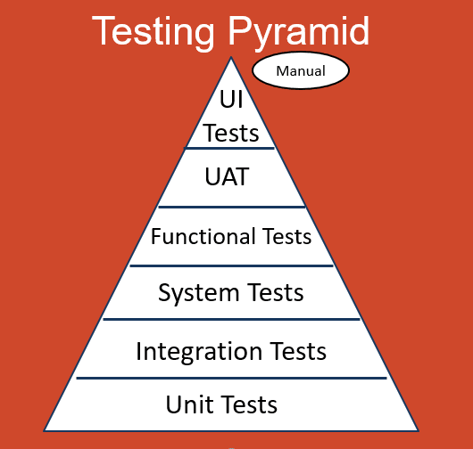
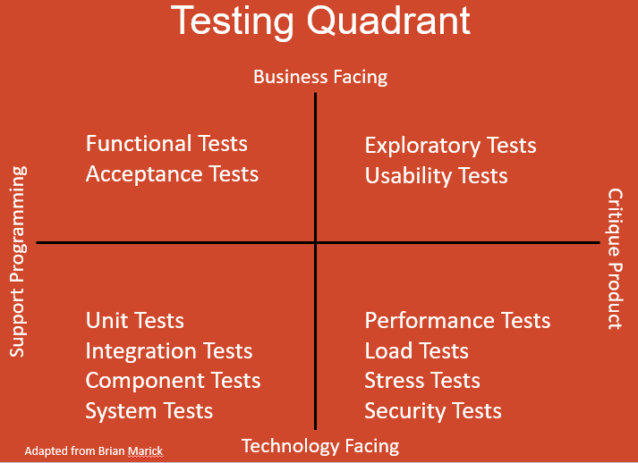

## Test Planning

Test planning involves:
 - Documenting the schedule and operations of achieving test objectives
 - Ensuring activities meet criteria
 - Creating communication channels between the team and stakeholders
 - Adhering to existing higher policies and strategies or providing reasoning for deviation.

Usually includes the following:
 - Testing context
 - Assumptions and constraints
 - Stakeholder responsibilities and relevance
 - Communication channels and frequency + documentation details
 - Risk analysis
 - Testing approach
 - Constraints (budget + schedule)

In iterative SLDCs, we experience two types of planning in regards to how we organize tests:
 - **Release planning** - tests are planned around product releases and a product backlog. Largely driven by user stories.
 - **Iteration planning** - Breaks down the development process into iteration and manages an iteration backlog.

### Entry and Exi Criteria

**Entry Criteria** are the prerequisites for taking on any activity (testing or non-testing). These are to ensure the necessary resources, testware, and baseline quality of the product (previous tests or smoke tests) are in place before additional resources are allocated.
 - Usually called "Definition of Ready" for Agile methodologies

**Exit criteria** are the achievements necessary before a task is considered complete. These are to ensure a thorough undertaking of the activity and include throroughness checks (i.e. coverage achieved. density, resolved defects, test cases pass/failed), a yes/no checklist. static testing, reports, and automated tests. This can also be a running out of resources like time or budget.
 - Usually called "Definition of Done" for Agile methodologies

### Estimation Techniques

Estimation techniques allow for a prediction of the amount and intensity of test objectives. This can present a holistic view to stakeholders.
 - Generally, smaller task estimates are more accurate. Therefore, large tasks should be decomposed into smaller tasks.

Techniques include:

#### Estimation based on Ratios

Use internal historical data to estimate an unknown resource allocation. Can be a ratio of development to test ratio, with a known development time.

#### Extrapolation

Use early measurements and behavior to project future data for the same project. Generally best used for iterative SDLCs i.e. use the last few iterations to project the resources allocated for the next iteration.

#### Wideband Delphi

Experts independently estimate resource allocation. Then, if there are any outliers, experts reconvene and discuss until they can form a new estimation independetly. Example includes Planning Poker for Agile methodologies

#### Three-point Estimation

Experts form three distinct estimations: an optimistic case (best-case) called *a*, a likely case (average-case) called *m*, and a pessimistic case (worst-case) called *b*. The estimation is then formed based on a weighted arithmetic mean.

A common weighting is:
$$
E = \frac{a + 4m + b}{6}
$$

with standard deviation:

$$
\sigma = \frac{b - a}{6}
$$

### Test Case Prioritization

Tests are assembled into suites and then run based off of priority:

 - **Risk-based priority** - Execute based off of the most important risk factors
 - **Coverage-based priority** - Execute tests from the highest to lowest coverage. In additional coverage priority, tests are ordered based on marginal coverage.
 - **Requirements-based priority** - Execute based off of the priority of the requirements defined by stakeholders.

Priorities may need to be put aside if higher priority test cases have a prerequisite lower priority test case and depending on the availability of resources.

### Testing Pyramid

Organizes testing levels based off of granularity, isolation, and execution time.

Generally, unit tests have highest granularity, isolation, and lowest execution time, followed by service/integration tests, and lastly UI and end-to-end tests.

Different levels may also have different level of support for test automation.

### Testing Quadrants

Organizes tests into two axes: business facing vs technology facing and team support (development guidance) vs. product critique (measuring against expectations).

## Risk Management

Risk Management is the practice of analyzing internal and external risk factors and acutely controlling them.

Risks are any potential events that could have adverse development affects.

The level of the risk can be characterized by a risk likelihood between 0 and 1, and a risk impact indicating the concequences.

Risks can be a:
 - **Project risk** involving the management of an entire project including organizational issues (delays, inaccurate estimates, constraints), people issues (skills, communication, conflicts), technical issues (scope and tools), and supplier issues (delivery failure).
    - Can impact project schedule, budget, and scope.
 - **Product risk** involving the quality of the deliverable product including incorrect behavior, inefficiencies, security vulnerabilities, poor UX or design errors.
    - Can impact user satisfcation, revenue/reputation, product maintenance, legal/regulatory labilities, and other damages.

### Risk Analysis

Focus on minimizing the greatest risks. Start analysis as early as possible in:
 - Identifying potential risks with the help of stakeholders
 - Assessing the identified risks for the likelihood and impact. Then, prioritize handling the highest level risks.

Assessment of risk level can be quantitative (multiply likelihood and impact) or qualitative (categorize likelihood and impact and then refer to a risk matrix).

Afterwards, this helps:
 - Determine testing scope, level, types, and resources necessary for particular portions of the product.
 - Prioritize the testing schedule (most critical first)

### Risk Control

Consists of measures to manage risk. This includes:
 - **Risk mitigation** - actions to reduce risk levels of identified risks
 - **Risk monitoring** - actions to increase effectiveness of risk mitigation and assessment.

Outcomes can include risk reduction via testing, risk acceptance, risk transfer, or contingency plans.

## Test Monitoring, Control, and Completion

Test mointoring is the continuous gathering of information to assess testing progress in regards to entry and exit criteria.

Test control is the usage of information on testing progress to control the flow of testing. This includes:
 - Test reprioritization
 - Entry and exit criteria re-evaluation
 - Test schedule and resource allocation adjustments based off of changes in available resources

Test completion is the consolidation of data pertaining to test activities following a project milestone (i.e. an agile sprint).

### Testing Metrics

When monitoring, important testing progress metrics to pay attention to include:
 - Overall project progress (task completion, resources used, testing effort)
 - Test progress (test case and environment implementation, cases executed/passed/failed, execution time)
 - Overall product quality (availability, response time, time to failure)
 - Defects found//fixed and density
 - Risk levels
 - Coverage amount and requirements
 - Cost

Frequent test reports help with communicating testing status to better inform decision making.

Information in these reports can include:
 - Period in testing
 - Progress in relation to schedule and any deviations
 - Any major roadblocks and workarounds
 - Metrics used
 - Risks
 - Next steps

Upon test completion, we can have another debriefing report. Structually, they include:
 - Summaries
 - Test objectives and exit criteria
 - Deviations from the plan
 - Unfixed defects
 - Aggregate progress report info
 - Lessons learned

To facilitate management, frequent communication is crucial. This can be in the form of:
 - Verbal communication
 - Electronic communication
 - Shared dashboards
 - Documentation
 - Test reports

Tailor communication based on the target audience (i.e. non-technical stakeholders vs. technical team members)

## Test Management

**Configuration management** involves the total control flow of work products including all test plans, strategies, conditions, cases, scripts, results, logs, and reports.

More complex configuration items can also be tracked such as test environments over time.

Generally, this includes some version control so test results can be reproduced.

**Defect management** is the workflow for handling defects including logging, analysis and classification, and responding, and reporting.

Generally involves stakeholders to match with product requirements.

Defect reports generally provide:
 - Information for those involved with addressing the defect
 - A means of tracking progress
 - Improvement avenues for the development process

Structurally, they include:
 - A unique identifier
 - A title and short summary of the behavior
 - Information including date, location, and enviornment
 - Expected vs. actual behavior
 - Severity of the defect and the associated priority
 - Current status + any references