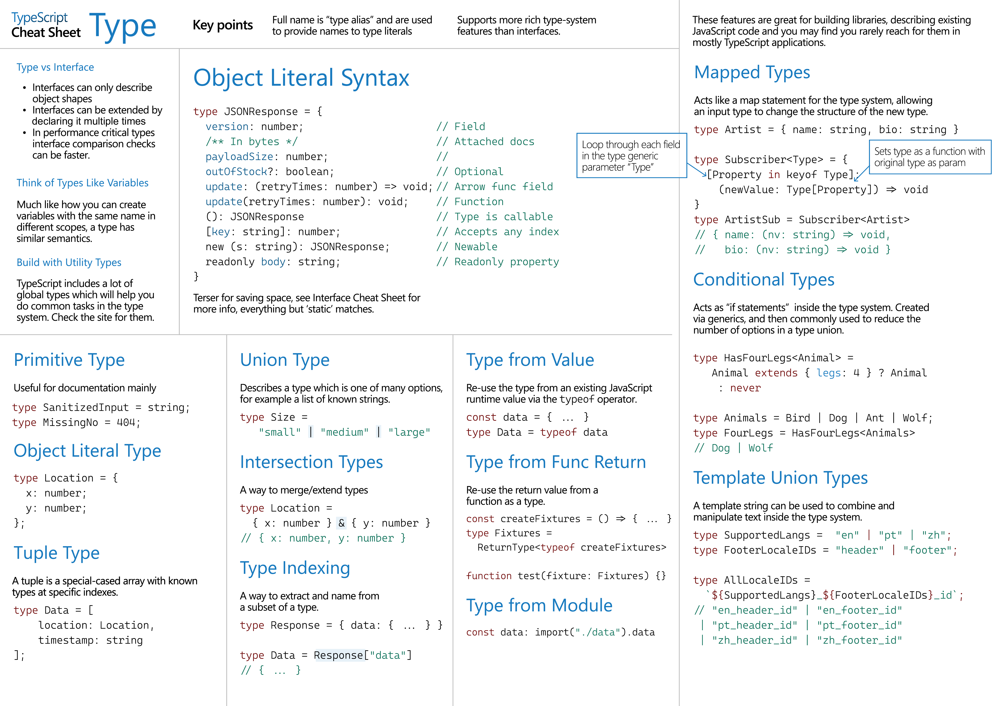
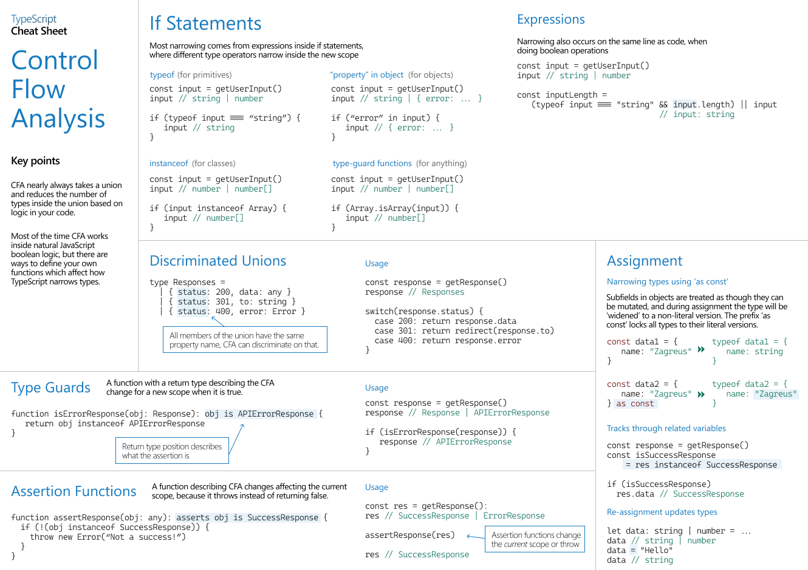
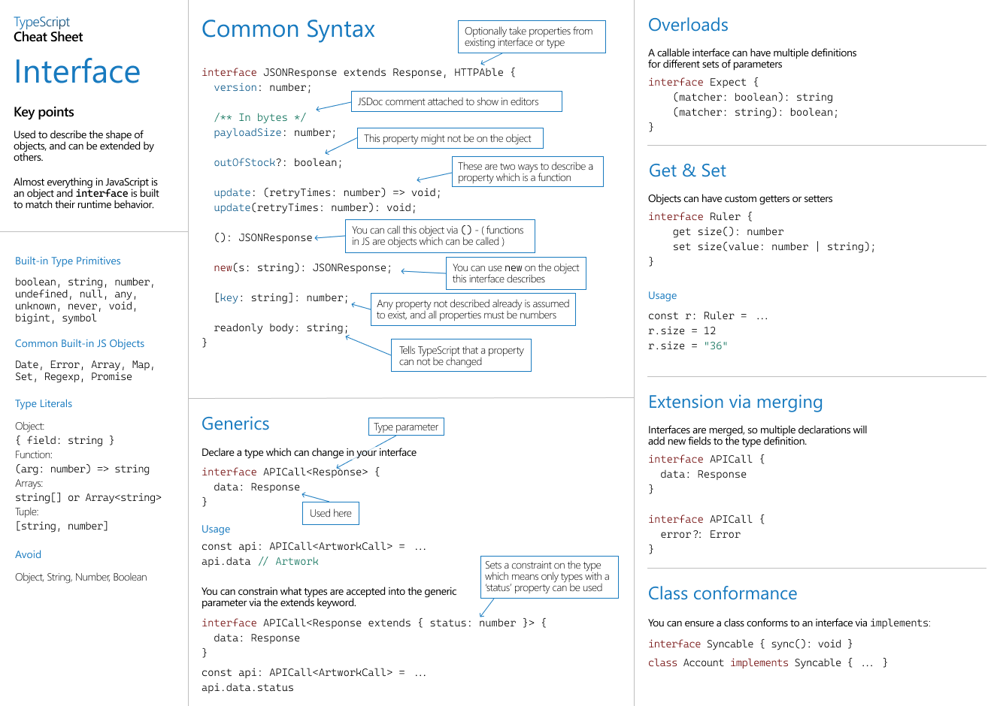
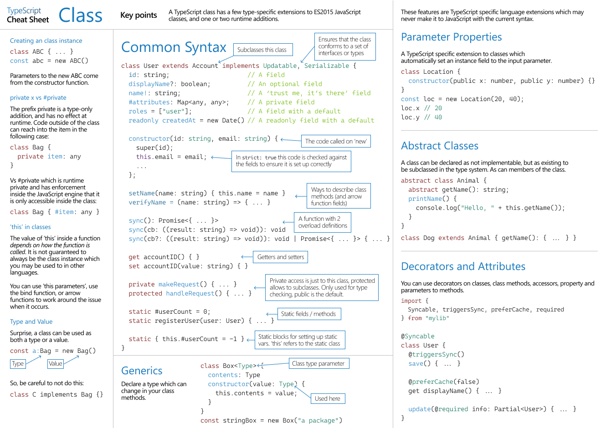

### Trussworks and Material UI

Trussworks and Materual UI (MUI) are both component libraries for React that follow conventional design patterns (similar to Bootstrap) over customization of raw CSS.

More specifically, Trussworks follows the [US Web Design System](https://designsystem.digital.gov/) (USWDS) and Material UI follows Google's [Material Design](https://m2.material.io/) specification.

To use them, install the libraries with: 

```bash
# Trussworks
npm i @trussworks/react-uswds

# MUI
npm i @mui/material @emotion/react @emotion/styled
```

Then, import specific components from the library wherever you need them and import the specified `css` file within your `App.jsx` file.

Trussworks Reference: https://trussworks.github.io/react-uswds/?path=%2Fdocs%2Fwelcome--docs
MUI Reference: https://mui.com/material-ui/getting-started/installation/

### API Calls in React

Before React 19, it's best to put asynchronous `fetch` requests within a `useEffect` callback with an empty dependency list to make sure it only runs on our component mount.

We can then use the HTTP response to modify a stateful variable and say render a table:

```JS

export default function Component() {
    const [state, setState] = useState([]);

    useEffect(async () => {
        const data = await fetch("url");
        const jsonData = await data.json();

        setState(jsonData);
    }, []);

    return (
        <Table>
            {state.map(d => {
                return (
                    <TableRow data={d} />
                )
            })}
        </Table>
    );
}
```

If you want to update a table: you can use a `POST` request in a handler (like a form button's `onSubmit`) and update the state.

One way to improve user experience is to optimistically update your state before you receive confirmation from the server. If the request fails, then rollback the change.

Note that if you're planning on mapping data to elements directly (not handled by a third-party library), then you want to pass in a unique `key` prop into the elements so React can better handle state changes.

## React Router

React router provides client-side routing to specify routes and components to render at each route. It's used to create seamless Single Page Applications that don't refresh the browser by making use of the History API.

To begin, install the Browser Router with:

```bash
npm i react-router-dom
```

To use the router, change your `App.jsx` to return a `BrowserRouter` component. Create a `Routes` component child within the `BrowserRouter`. Lastly, define routes using `<Routes path="" element={<Component />} />`

Overall, it should look something like this:

```JSX
export default function App() {
    return (
        <BrowserRouter>
            <Routes>
                <Route path="/" element={<Home />}>
                <Route path="/settings" element={<Settings />}>
                <Route path="/dashboard" element={<Dashboard />}>
            </Routes>
        </BrowserRouter>
    );
}
```

You may also want to have persistent components such as a shared navbar throughout your entire application. 

To achieve this, use a `LayoutRoute` which is a doubly-tagged `Route` component that has an `Outlet` component to in its specified element to render the child routes:

```JSX
export default function App() {
    return (
        <BrowserRouter>
            <Routes>
                <Route path="/" element={<Layout />}>
                    <Route path="/settings" element={<Settings />}>
                    <Route path="/dashboard" element={<Dashboard />}>
                </Route>
            </Routes>
        </BrowserRouter>
    );
}
```

Reference: https://reactrouter.com/start/declarative/routing

## TSX

Typescript is a superset of Javascript developed by Microsoft and provides type definitions and type checking for Javascript.

It still includes type inference, but allows for additional features such as a more complete static type checking system, type narrowing, and nullable checking.

Key concepts:

 - For non-inferred variables, define them like so:

```TS
const myVar: number = 1;
```

 - For functions, specify the parameters and return types:

```TS
function myFunc(x: number, y: number): number {
    return x + y;
}
```

 - Use interfaces to define object structure (useful for React props for instance)

```TSX
interface ITableRow {
    name: string,
    age: number,
    email: string
}

export default function TableRow({ name, age, email }: ITableRow) {
    return (
        <tr>
            <td>{name}</td>
            <td>{age}</td>
            <td>{email}</td>
        </tr>
    );
}

```

#### Cheatsheets






Reference: https://www.typescriptlang.org/docs/handbook/2/basic-types.html

### useReducer Hook

The `useReducer` hook is used for managing more complex states. After importing, you pass in a `Reducer` function that takes in two parameters:
 - `state` - the previous state
 - `action` - has shape `{ type: string, payload: any }` and defines the action the reducer function takes.

The reducer function then defines multiple actions via the `type` parameter of action.

In addition to the reducer function, you pass in an initial value or generator function.

Similar to the `useState`, `useReducer` returns a tuple of two values that you destructure by convention:

 - `state` - a stateful variable
 - `dispatch` - a dispatch function that takes in a single parameter: an `action` of the same type of your `reducer` function. This can then be used to call your reducer function to mutate state.

```JSX
const [state, dispatch] = useReducer((prev, action) => {
    switch (action.type) {
        case "INCREMENT":
            return { ...prev, count: prev.count + 1};
        case "DECREMENT":
            return { ...prev, count: prev.count - 1};
        case "SET":
            return { ...prev, count: action.payload };
    }
} , { count: 0 });

return(
    <>
        <button onClick={() => dispatch({ type: "INCREMENT" })}> + </button>
        <button onClick={() => dispatch({ type: "DECREMENT" })}> - </button>
        <button onClick={() => dispatch({ type: "SET", payload: 0 })}> Reset </button>

        <h1>Current Count: {count}</h1>
    </>
);

```

Reference: https://react.dev/reference/react/useReducer